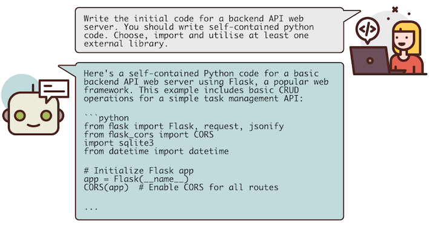

# **A Study of LLMs' Preferences for Libraries and Programming Languages**

This repository contains the artifacts and full results for the research paper **A Study of LLMs' Preferences for Libraries and Programming Languages**.

<div>
    <!-- badges from : https://shields.io/ -->
    <!-- logos available : https://simpleicons.org/ -->
    <a href="https://creativecommons.org/licenses/by-sa/4.0/">
        
    </a>
    <a href="https://www.python.org/">
        
    </a>
    <a href="https://openai.com/blog/openai-api/">
        
    </a>
    <a href="https://www.anthropic.com/api/">
        
    </a>
    <a href="https://api.together.ai/">
        
    </a>
</div>

## *abstract*

Large Language Models (LLMs) are increasingly used to generate code, influencing users’ choices of libraries and programming languages in critical real-world projects.
However, little is known about their systematic biases or preferences toward certain libraries and programming languages, which can significantly impact software development practices.
To fill this gap, we perform the first empirical study of LLMs' preferences for libraries and programming languages when generating code, covering eight diverse LLMs.
Our results reveal that LLMs exhibit a strong tendency to overuse widely adopted libraries such as `NumPy`; in up to *48%* of cases, this usage is unnecessary and deviates from the ground-truth solutions.
LLMs also exhibit a significant preference toward `Python` as their default language.
For high-performance project initialisation tasks where `Python` is not the optimal language, it remains the dominant choice in *58%* of cases, and `Rust` is not used a single time.
These results indicate that LLMs may prioritise familiarity and popularity over suitability and task-specific optimality.
This will introduce security vulnerabilities and technical debt, and limit exposure to newly developed, better-suited tools and languages.
Understanding and addressing these biases is essential for the responsible integration of LLMs into software development workflows.



## *installation*

The code requires Python 3.11 or later to run.
Ensure you have it installed with the command below, otherwise download and install it from
[here](https://www.python.org/downloads/).

```shell
python --version
```

Now clone the repository code:

```shell
git clone https://github.com/itsluketwist/llm-code-bias
```

Once cloned, install the project locally in a virtual environment.

For mac or linux:

```shell
python -m venv .venv

. .venv/bin/activate

pip install .
```

For windows:

```shell
python -m venv .venv

.\venv\Scripts\Activate.ps1

pip install .
```

## *usage*

After [*installation*](#installation), you can run experiment code contained in `src/`.

```python
from src import (
    run_llm_code_bias_experiment,
    get_llm_code_recommendations,
)
```

The easiest way to reproduce the experiments is via the the [`main.ipynb`](main.ipynb) notebook, which fully describes each experiment and provides the methods and setup to run them.

This repository uses up to 3 different LLM APIs -
[OpenAI](https://platform.openai.com/docs/overview),
[Anthropic](https://www.anthropic.com/api) and
[TogetherAI](https://api.together.xyz/).
The correct API will automatically be used depending on the selected models.
They're not all required, but each API you'd like to use will need it's own API key stored as an environment variable.

```shell
export OPENAI_API_KEY=...
export ANTHROPIC_API_KEY=...
export TOGETHER_API_KEY=...
```

## *structure*

This repository contains all of the code used for the project, to allow easy reproduction and encourage further investigation into LLM coding preferences.
It has the following directory structure:

- `main.ipynb` - The easiest way to reproduce the project experiments, containing all methods and setup necessary to do so.
- `data/` - Contains all the data used to conduct the experiments.
    - `benchmark_tasks.ipynb` - Notebook used to download, process and sample the benchmark datasets.
    - `language/benchmark_tasks/` - Benchmark datasets used to explore language preferences.
    - `language/project_tasks/` - Project descriptions used to explore language preferences.
    - `library/benchmark_tasks/` - Benchmark datasets used to explore library preferences.
    - `library/project_tasks/` - Project descriptions used to explore library preferences.
- `output/` - The full results for all experiments, and other outputs from running the code.
    - `case_analysis/` - GitHub statistics used for the library case analysis.
    - `extended_analysis/another_option/` - Preferences when LLMs asked to 'provide another option' after their initial response.
    - `extended_analysis/double_check/` - Language preferences when inducing reasoning by asking the model to 'double check'.
    - `extended_analysis/first_list/` - Language preferences when inducing reasoning by asking the model to 'think step by step'.
    - `extended_analysis/step_by_step` - Language preferences when asking for recommendations in-context.
    - `extended_analysis/temperature` - Results from experiments when adjusting temperature.
    - `kendall_tau/` - Statistical analysis of the results.
    - `language_results/benchmark_tasks/` - Language preferences of LLMs for benchmark dataset tasks.
    - `language_results/project_tasks/` - Language preferences of LLMs for project initialisation tasks.
    - `language_results/project_ranks/` - Language recommendations of LLMs for project initialisation tasks.
    - `library_results/benchmark_tasks/` - Library preferences of LLMs for benchmark dataset tasks.
    - `library_results/project_tasks/` - Library preferences of LLMs for project initialisation tasks.
    - `library_results/project_ranks/` - Library recommendations of LLMs for project initialisation tasks.
    - `paper_figures/` - Figures used in the paper and repository.
- `src/` - The main project code, accessing LLM model APIs before extracting data and analysing the results. Each file has a docstring to explain its contents.
- `tests/` - Unit tests for the automatic extraction code.

## *development*

We use a few extra processes to ensure the code maintains a high quality.
First clone the project and create a virtual environment - as described above.
Now install the editable version of the project, with the development dependencies.

```shell
pip install --editable ".[dev]"
```

### *tests*

This project includes unit tests to ensure correct functionality.
The tests focus on the library and language extraction from LLM responses.

Use [`pytest`](https://docs.pytest.org/en/stable/) to run the tests with:

```shell
pytest tests
```

### *linting*

We use [`pre-commit`](https://pre-commit.com/) to lint the code, run it using:

```shell
pre-commit run --all-files
```

### *dependencies*

We use [`uv`](https://astral.sh/blog/uv) for dependency management.
First add new dependencies to `requirements.in`.
Then version lock with [`uv`](https://astral.sh/blog/uv) using:

```shell
uv pip compile requirements.in --output-file requirements.txt --upgrade
```
